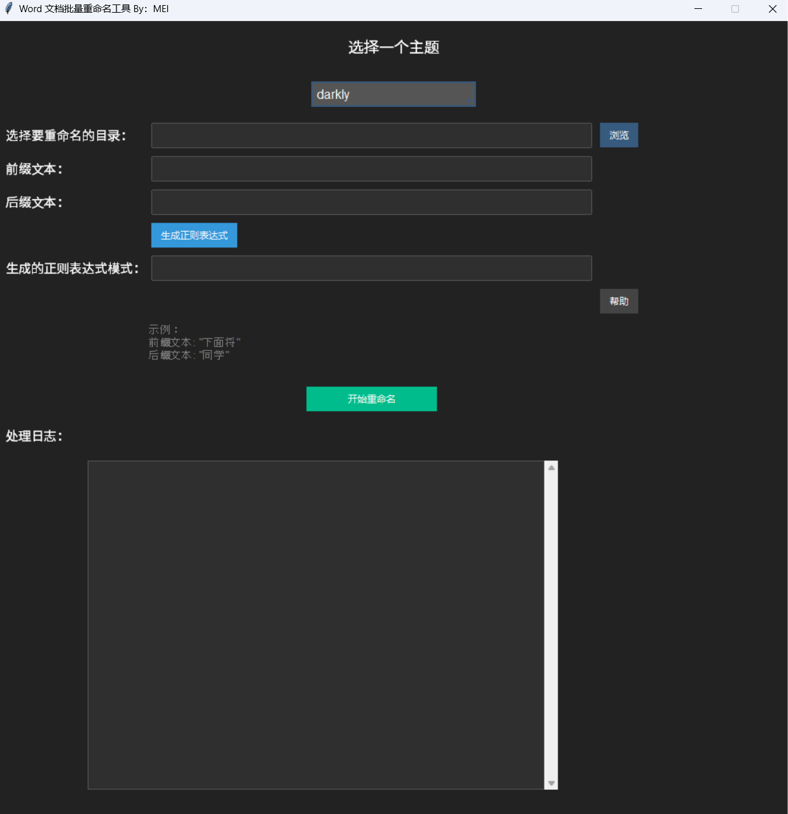

# Word Rename Tool / Word文档重命名工具

 
## Overview / 概述

**Word Rename Tool** is a Python-based tool for batch renaming Word document files. It features a modern GUI interface and powerful regex functionality, allowing users to efficiently extract specific information from document content and rename files automatically.

**Word文档重命名工具**是一个基于Python的工具，用于批量重命名Word文档文件。该工具结合现代化的GUI界面和强大的正则表达式功能，能够高效地提取文档内容中的特定信息，并自动重命名文件。

---

## Features / 特性

- **Batch Processing**: Process multiple Word documents at once.
- **Regex Extraction**: Extract key content from documents based on user-defined prefixes and suffixes.
- **User-Friendly Interface**: Modern GUI built with `Tkinter` and `ttkbootstrap`.
- **Fully Customizable**: Choose directories, regex rules, and custom file naming formats.
- **Format Support**: Supports `.doc` and `.docx` files.

- **批量处理**：支持一次处理多个Word文档。
- **正则提取**：根据用户输入的前缀和后缀，智能提取文档中的关键内容作为文件名。
- **界面友好**：基于`Tkinter`和`ttkbootstrap`的现代化GUI。
- **完全可定制**：用户可选择目录、正则规则，及自定义文件名格式。
- **格式支持**：支持`.doc`和`.docx`文件。

---

## Usage / 使用说明

### Requirements / 环境要求

1. Python 3.8 or above.
2. Installed dependencies:
   - `ttkbootstrap`
   - `pywin32`

   **Install dependencies**:
   ```bash
   pip install ttkbootstrap pywin32
   ```

1. Python 3.8 或以上版本。
2. 安装下列依赖库：
   - `ttkbootstrap`
   - `pywin32`

   **安装依赖库**：
   ```bash
   pip install ttkbootstrap pywin32
   ```

### Steps / 使用步骤

1. Download or clone this repository:
   ```bash
   git clone https://github.com/BilibiliXiaoYun/WORDRENAME.git
   cd WORDRENAME
   ```

2. Start the tool:
   ```bash
   python main.py
   ```

3. Use the GUI to perform the following operations:
   - Select the directory containing Word documents to process.
   - Enter prefix and suffix texts to generate a regex pattern.
   - Click the "Start Renaming" button to automatically extract content and rename files based on the regex pattern.

1. 下载或克隆本仓库：
   ```bash
   git clone https://github.com/BilibiliXiaoYun/WORDRENAME.git
   cd WORDRENAME
   ```

2. 启动工具：
   ```bash
   python main.py
   ```

3. 使用GUI完成以下操作：
   - 选择需要处理的Word文档目录。
   - 输入前缀和后缀文本，生成正则表达式。
   - 点击“开始重命名”按钮，工具会根据正则自动提取内容并重命名文件。

---

## Example Interface / 示例界面

 

---

## Custom Icon / 自定义图标

This tool supports custom window icons. To replace the icon, use your `.ico` file and name it `my_icon.ico`, placing it in the root directory of the project.

本工具支持自定义窗口图标。如果需要更换图标，请使用您的`.ico`文件，并命名为`my_icon.ico`，将它放置在项目根目录中。

---

## Contributing / 贡献

Contributions are welcome! Feel free to submit suggestions or contribute code. If you encounter any issues, please contact us via [Issues](https://github.com/BilibiliXiaoYun/WORDRENAME/issues).

欢迎对本项目提出建议或贡献代码！如果遇到任何问题，请通过[Issues](https://github.com/BilibiliXiaoYun/WORDRENAME/issues)与我们联系。

---

## License / 许可证

This project is licensed under the [MIT License](LICENSE).

本项目采用[MIT许可证](LICENSE)开源。

---

## Author / 作者

- **BilibiliXiaoYun** - [GitHub](https://github.com/BilibiliXiaoYun)

